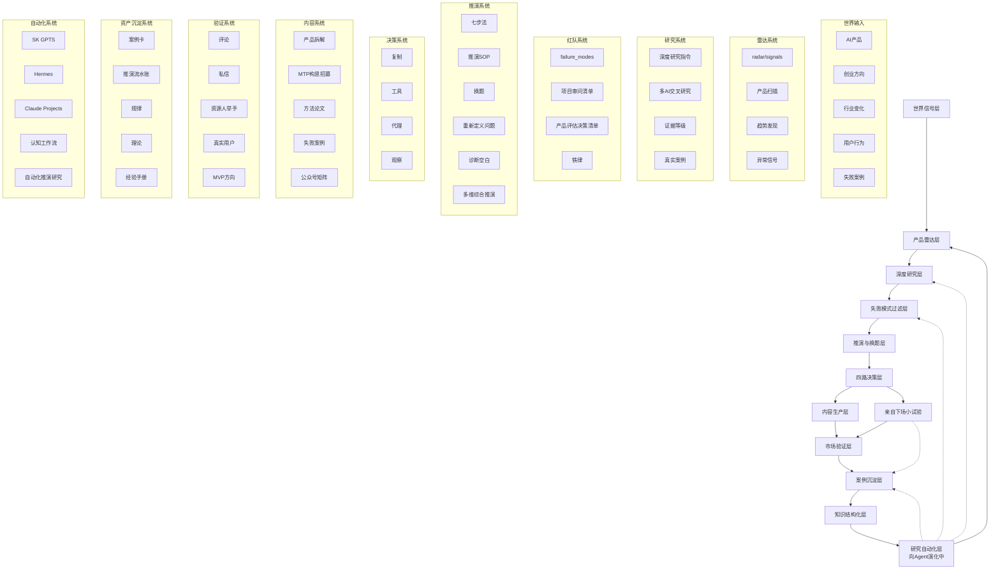

# SK 认知操作系统总图

> 版本：v1.1 · 2026-05-09
> 状态：基于当前 SK 仓库结构与方法论的系统级抽象
> 目的：把当前 SK 仓库里已经形成的「认知→研究→推演→内容→验证→沉淀→Agent」链路，完整画出来。

> **重要前置说明（v1.1 新增）**：本图所用「操作系统」一词是**隐喻**，不是已经建成的工程系统。SK 当前实际状态以人 + 文档为主，Agent 为增量，自动化为远景。OS 表述用来对齐方向，不用来宣称能力。读图时请把每一层的成熟度标记（🟢🟡⚪）当作真实读数，不要把愿景当现状。

---

# 一、先说结论

SK 本质上已经不是：

- AI 产品拆解仓库
- 公众号写作仓库
- GPTS 提示词仓库
- 创业想法仓库

而是：

# 一套「AI 时代的小团队认知工业化系统」

它的目标不是：

> "更快写文章"

而是：

> "让小团队低成本、系统化地产生判断、验证判断、积累判断。"

这是一个：

- 判断力系统
- 推演系统
- 研究系统
- 内容系统
- 验证系统
- Agent 化系统

的组合体。

---

# 二、SK 的真正主线

SK 当前真正的主线：

```text
世界出现信号
    ↓
雷达捕获信号
    ↓
结构化研究
    ↓
失败模式过滤
    ↓
重新定义问题
    ↓
形成推演
    ↓
亲自下场小试验 ⬅️ v1.1 补
    ↓
公开内容验证
    ↓
真实用户/资源人反馈
    ↓
形成案例资产
    ↓
沉淀为判断规则
    ↓
进入 Agent / GPTS / 工作流
    ↓
反过来增强下一轮判断
```

这已经是：

# 一个闭环认知飞轮

而不是内容生产流程。

**v1.1 注**：v1.0 主线里漏了「亲自下场小试验」一环——这是三湘问道方法论里"看一千部电影一边写自己的剧本"的"剧本"部分。少了它，飞轮就退化成研究型自媒体的循环。

---

# 三、SK 认知操作系统总图（核心图）



**v1.1 修订说明**：
- K（自动化层）不只回灌到 B（雷达），还应回灌到 C（研究）/D（红队）/I（沉淀）——表示新一轮判断不一定从扫信号开始，更多时候从「研究模板更新、红队规则迭代、案例库重组」开始。
- 新增节点 X「亲自下场小试验」——挂在四路决策（F）之后、市场验证（H）之前，承接「复制/工具/代理」三路里需要真实下场的部分（不含「观察」）。

---

# 四、SK 六大层级（这是仓库真正结构）

## 4.0 图文对齐表（v1.1 新增）

mermaid 流程图节点 A–K 与下文 Layer 1–6 的对应关系：

| Mermaid 节点 | 归属 Layer | 备注 |
|---|---|---|
| A 世界信号层 | 输入侧 | 不属于六层，是六层的输入源 |
| B 产品雷达层 | 输入侧 | 同上 |
| C 深度研究层 | 跨层 | 主要服务于 Layer 1（红队过滤）和 Layer 2（推演判断） |
| D 失败模式过滤层 | Layer 1 | 红队/排除 |
| E 推演与换题层 | Layer 2 | 判断核心 |
| F 四路决策层 | Layer 2 | 判断的输出形态 |
| X 亲自下场小试验 | Layer 2 ↔ Layer 4 桥 | v1.1 新增 |
| G 内容生产层 | Layer 3 | 外显 |
| H 市场验证层 | Layer 4 | 反馈接入 |
| I 案例沉淀层 | Layer 5 | 写入 |
| J 知识结构化层 | Layer 5 | I 的可调用化（5 内子层） |
| K 研究自动化层 | Layer 6 | 向 Agent 演化中 |

**关于 J（知识结构化）**：在 v1.0 里 J 在图里有独立节点但在六层正文中无对应名字，导致读者困惑。v1.1 明确：J 是 Layer 5 内部的**子层**——案例卡（I）是原始资产，知识结构化（J）是把它变成可被 RAG / Agent 调用的形式。J ⊂ Layer 5。

## 4.1 资产双挂归属（v1.1 新增）

部分核心资产会跨层出现，容易被误读为分类重复。明确「写入 vs 引用」：

| 资产 | 写入层（在哪里被生产/维护） | 引用层（在哪里被调用） |
|---|---|---|
| failure_modes | Layer 1（红队系统维护规则） | Layer 2、3、4 全局只读引用 |
| 三湘问道铁律 | Layer 1 | 全局只读引用 |
| 案例卡 | Layer 5（沉淀写入） | Layer 1 红队对照 / Layer 2 推演起点 / Layer 3 内容素材 |
| 推演流水账 | Layer 5 | Layer 2 复盘、Layer 3 内容素材 |
| 理论文档 | Layer 5（理论库写入） | Layer 2 推演每一步调用 |

规则：**一个资产的「主层级」 = 它的写入层**。其他层是只读消费者。这条规则也用来决定文件物理路径（比如 failure_modes 应当放在红队/排除相关目录而不是沉淀目录）。

---

# Layer 1 · 世界观层（决定什么不做） 🟢 ~85%

对应文件：

- 《三湘问道铁律》
- 《failure_modes》
- 《项目审问清单》

这一层不是教你成功。

这一层：

# 先排除不可能。

它最接近：

- AlphaFold 的排除法
- Buffett 的反向思维
- YC 的 startup kill test

核心能力：

```text
识别：
- 伪需求
- 无飞轮
- 低频
- 红海
- 平台依赖
- 创始人错配
- 时间窗口关闭
```

这一层本质：

# 创业红队系统

**成熟度评估（v1.1）**：铁律、failure_modes、项目审问清单已成型并被多个场景实际调用，是六层中最坚固的一层。仍待补：清单草稿→候选→正式的升级流水线还没跑通过完整一轮。

---

# Layer 2 · 判断层（真正核心） 🟡 ~60%

对应文件：

- 《推演SOP》
- 《AI产品复制推演框架》
- 《多维综合推演框架》
- 《诊断空白赛道拆解库》

这是 SK 最核心的层。

它真正做的事情：

# 重新定义问题。

不是：

> "这个产品是什么？"

而是：

> "这个产品真正解决的那道题是什么？"

例如：

| 表面产品 | 真正问题 |
|---|---|
| MYHAIR AI | 用户不知道自己的不知道 |
| Yoodli | 高风险表达无法低成本训练 |
| Gamma | 内容产出物天然带分发 |
| Paid | AI时代收费逻辑变化 |

所以 SK 的真正能力不是：

# 产品分析

而是：

# 问题重定义

**成熟度评估（v1.1）**：推演 SOP 八步法和灵感激发模式已稳定，理论库已能为每一步调用对应文档。但「四路决策（复制/工具/代理/观察）」的内部决策标准仍偏感性，没有量化阈值；推演完成后是否进入下场小试验、按什么标准下场，也尚未沉淀成规则。

## 2.1 止损与资源约束（Layer 2 子模块，⚪ 在建）

> v1.1 新增。AI2 的评估指出：v1.0 在「研究→过滤→推演」之后直接跳到「内容生产」，中间缺少**资源约束评估**和**止损规则**。failure_modes 是事前排除，本子模块是事中纠偏。

进入推演的项目，应明确以下字段（当前未成文，先在此占位）：

```text
- 需要几人 / 多少时间 / 多少预算
- 硬性退出条件示例：
    - 3 个月无付费意愿验证 → 冻结
    - 5 篇内容无资源人举手 → 换题或换平台
    - 2 个月无下场试验进展 → 降级到「观察」
- 何时必须见到第一个验证信号
- 谁负责拍板止损（避免沉没成本绑架）
```

裁决标准（草案，待验证）：**"哪个方向能在 30 天内产生一个可验证的付费信号或资源人举手？"** 能产生的，优先级 +1；不能产生的，进入观察区。

这个子模块当前为占位，下次有项目跑完一轮后再回来填实数据。

---

# Layer 3 · 内容层（很多人误以为这是主体） 🟢 ~80%

对应文件：

- 《文章模板》
- 《公众号写作指南》
- 《MTP构思招募法》
- 《内容生产经验手册》

这一层真正作用：

不是写文章。

而是：

# 对外发信号。

SK 内容的真正目标：

| 内容类型 | 真正目标 |
|---|---|
| 产品拆解 | 建立判断力信任 |
| MTP | 招募资源人 |
| 方法论 | 建立认知壁垒 |
| 死法图谱 | 证明不是只会吹 |
| 推演 | 展示思考路径 |

所以公众号不是媒体。

而是：

# 外部验证接口

**成熟度评估（v1.1）**：article_template、写作指南、MTP 招募法均已成稿并被实际调用。"先说结论"全局规则已上锁。仍待补：内容→验证的转化漏斗（哪几篇带来了哪些资源人）尚未结构化记录。

---

# Layer 4 · 验证层（这是 SK 最容易被低估的地方） 🟡 ~30%

对应逻辑：

```text
内容发出去
    ↓
谁会来？
谁反驳？
谁举手？
谁沉默？
谁愿意付钱？
```

这里其实已经形成：

# AI时代的公开式创业验证系统

而不是传统：

- 做产品
- 拉融资
- 找用户

SK 是：

```text
先发信号
    ↓
真实的人自己出现
    ↓
再决定要不要下场
```

这是《MTP构思招募法》的核心。

## 4.1 验证层的偏差声明（v1.1 新增）

公开式验证不是无噪声信号。把它当严谨数据源使用前，必须承认四类偏差：

- **同温层偏差**：高信任内容主要吸引同频者，他们不一定是目标市场。
- **沉默大多数**：举手的人占看见的人的极小比例；不举手不等于不感兴趣，也不等于反对。
- **付费信号滞后**：从"谁会来"到"谁愿意付钱"中间隔好几层，时间常常比预期长。
- **杠精误伤与捧场误判**：评论极端分布，正向反馈不一定是真信号，负向反馈不一定是真问题。

"评论区即真理"是对方法论的误读。验证层的健康度**不在反馈数量，在样本结构是否覆盖目标用户**。

**成熟度评估（v1.1）**：MTP 追踪表已建立，但实际验证数据样本量很小，未形成统计意义；偏差校正规则尚未成文。这一层是 v1.1 之后最该重点补的位置。

---

# Layer 5 · 知识沉淀层（真正复利开始的地方） 🟡 ~50%

对应文件：

- 案例卡
- 推演流水账
- failure_modes（**引用**，写入在 Layer 1）
- 证据等级
- 理论库

这里已经不是文档。

而是：

# 可结构化调用的认知资产

这意味着未来可以：

- RAG
- Agent 自动调用
- 自动案例对比
- 自动失败预警
- 自动发现模式
- 自动生成推演起点

这是：

# "判断力数据库"

**子层 J · 知识结构化（v1.1 显式化）**：把案例卡、流水账等原始资产改造成可被 Agent / RAG 调用的格式。J ⊂ Layer 5，是 Layer 5 走向 Layer 6 的桥。

**成熟度评估（v1.1）**：案例卡库、推演流水账、failure_modes 已结构化在积累；理论库已被推演 SOP 引用。但"被 Agent 自动调用"还基本没发生——RAG 接入、案例自动匹配都属于愿景。

---

# Layer 6 · 研究自动化层（向 Agent 演化中） ⚪ ~15%

> v1.1 改名说明：v1.0 称此层为「Agent 层」，会让人误以为已具备 Agent 能力。改为「研究自动化层（向 Agent 演化中）」更贴近现状——当前能力是把研究的某些步骤自动化，不是让系统替人判断。

对应：

- SK GPTS（深度研究员，v1.3.1 定稿）
- Claude Projects
- Hermes
- 工作流
- 自动研究

这一层方向已经清楚：

```text
知识库
    → 可调用
        → 可推演
            → 可协作
                → 可持续成长
```

但当前实际能力**仅限**于：

- 降低深度研究的信息收集成本
- 统一输出格式（证据账本、矛盾点）
- 多案例并行对比
- 按指令执行结构化研究

**它不替代判断**。判断必须留在人类（Layer 2）手中——这是 SK 的底线。

未来 SK 可能会变成"会工作的认知系统"，但 v1.1 时点不能这样宣称。

**成熟度评估（v1.1）**：仅深度研究员 GPTs 一个有形的产物；其余多为规划。这一层是六层中最薄的一层，明面写下来才不会自我欺骗。

---

# 五、SK 当前真正的飞轮（v1.1 修订）

很多人会误以为：

```text
写文章 → 涨粉 → 赚钱
```

但 SK 真正飞轮不是这个。

**v1.0 飞轮**（不完整）：

```text
研究产品 → 发现规律 → 写内容 → 吸引同频者
    → 获得真实问题 → 进入更深推演
    → 沉淀案例与规则 → 增强判断力
    → 下一轮研究更强
```

这条飞轮是**研究型自媒体**的飞轮，不是三湘问道的飞轮——少了"剧本"。

**v1.1 飞轮**（补齐"亲自下场"环）：

```text
研究产品 → 发现规律 → 写内容 → 吸引同频者
    → 获得真实问题
    → 【亲自下场小试验】          ⬅️ 补
    → 【真实反馈：失败 / 成功】     ⬅️ 补
    → 沉淀案例与规则
    → 修正判断假设                ⬅️ 补
    → 增强判断力
    → 下一轮研究更强
```

差别不在多了几个字，而在飞轮性质：

| v1.0 | v1.1 |
|---|---|
| 纯认知循环 | 认知 + 实践双线 |
| 反馈来自读者 | 反馈来自读者 + 真实试验 |
| 错误靠自查 | 错误靠现实击打 |
| 像研究院 | 像三湘问道 |

所以：

# 内容不是终点。

内容是：

# 判断系统的外显之一；亲自下场是判断系统的另一只脚。

---

# 六、SK 当前最危险的问题

现在最大的风险不是：

- 不够深
- 不够系统
- 案例不够多

真正危险：

# 三条主线正在同时增长。

```text
媒体化
创业研究院化
认知操作系统化
```

这三件事：

- 节奏不同
- 目标不同
- KPI 不同
- 资源结构不同

如果不统一：

仓库会越来越重。

**v1.1 补充**：北极星（下一节）只解决**意义对齐**，不自动解决**资源与节奏冲突**——同一周到底优先稿、优先案例卡、还是优先 Agent，需要 Layer 2 的子模块「止损与资源约束」给裁决标准。北极星是方向，时间盒是节奏，两者缺一不可。

---

# 七、我认为真正应该统一的北极星

不是：

> "AI 产品拆解"

也不是：

> "三湘问道公众号"

而是：

# "AI 时代的小团队判断力工业化。"

这是现在整个仓库真正已经在长出来的东西。

**v1.1 注**：这条北极星与《北极星文档》v4.2 不冲突——后者是战略层（"找 10x/100x 机会，押注十年"），本图所说的是**系统层**（"靠什么工业化能力去找"）。一个是目的，一个是手段。

---

# 八、SK 与传统创业体系的差别

> v1.1 注：本表用于**对内自检**「SK 在哪几条上更刻意」，不适合直接对外传播。把"先做产品 vs 先验证问题"做成二元对立，会被反驳为稻草人——精益创业、社区驱动、Build-in-Public 等大量已有实践与 SK 重叠。SK 的真正差异不在"做了别人没做的事"，而在"把这几件事整合在一个小团队闭环里"。

| 传统创业 | SK 更刻意的方向 |
|---|---|
| 先做产品 | 先验证问题 |
| 先融资 | 先召唤资源 |
| 用户访谈 | 公开式信号验证 |
| 商业计划书 | MTP |
| 经验靠人记 | 结构化案例库 |
| 顾问式分析 | failure_modes 红队 |
| 写文章传播 | 内容即验证 |
| 知识库 | 可推演认知系统 |

所以 SK 真正的方向同构于：

> YC 的反向筛除 + 贝索斯反向思维 + AlphaFold 式排除法 + Agent 工作流

在中文小团队场景里做一次本土化整合。

**注**：这里说的是**方向上的同构**，不是**能力上的对标**。SK 当前的样本量级远小于上述任何一个体系，不能把目标说成现状。这条注释专门写下来，防止自己被自己的类比骗了。

---

# 九、下一阶段真正缺的东西

现在最缺的已经不是：

- 更多框架
- 更多模板
- 更多理论

而是：

# "认知执行层"

即：

```text
看到信号
    ↓
自动触发研究
    ↓
自动匹配案例
    ↓
自动跑红队
    ↓
自动生成推演起点
    ↓
人类只做最终判断
```

也就是说：

# 从"知识库"升级为"认知引擎"。

这才是 SK 后面真正可能长成的东西。

**v1.1 现实修正**：这是**方向**，不是**当前能做的下一步**。当前能做的下一步是：

1. 把 Layer 4（验证层）的反馈数据真正记录下来——哪几篇内容带来了哪些资源人，谁举手了，谁付费了，谁沉默了。
2. 把 Layer 2 下的「止损与资源约束」子模块跑通一轮真实项目。
3. 把 Layer 5 的 J 子层（知识结构化）补一两个能被 RAG 调用的最小样本。

这三件事都是**人 + 文档**就能做的，不需要 Agent。Agent 是这三件事跑通之后的水到渠成，不是先做 Agent 再倒推前三件事。

---

# 十、v1.0 → v1.1 修订摘要

| # | 改动 | 落点 |
|---|---|---|
| 1 | 顶部加期望管理声明：OS 是隐喻，不是已建工程系统 | 文首 |
| 2 | 主线和飞轮加「亲自下场小试验」环 | §二、§五 |
| 3 | mermaid 闭环边补 K→C/D/I（不只回灌雷达） | §三 |
| 4 | mermaid 加 X 节点「亲自下场小试验」 | §三 |
| 5 | 新增图文对齐表（A–K ↔ Layer 1–6） | §4.0 |
| 6 | 新增 J ⊂ Layer 5 的归属说明 | §4.0 |
| 7 | 新增资产双挂归属表（写入 vs 引用） | §4.1 |
| 8 | 每层加成熟度标注（🟢🟡⚪ + %） | §四 各 Layer |
| 9 | Layer 2 下挂「止损与资源约束」子模块 | §2.1 |
| 10 | Layer 4 加偏差声明（同温层/沉默大多数/滞后/极端反馈） | §4.1（在 Layer 4 内） |
| 11 | Layer 6 改名「研究自动化层（向 Agent 演化中）」 | §四 Layer 6 |
| 12 | 第八节对比表加「对内自检用」注释 | §八 |
| 13 | 第八节末尾的 "YC + 贝索斯 + AlphaFold + GPT Agent 混合体" 改为「方向同构，非能力对标」 | §八 |
| 14 | 第九节加现实修正：当前能做的下一步是补验证数据、跑止损、做 RAG 最小样本 | §九 |

**v1.1 没动的部分**：第一节「先说结论」、第二节主线大结构（只补一个环）、第三节 mermaid 主体（只补节点和边）、第七节北极星措辞——这些是 v1.0 的骨架，不动。

**留给 v2.0 的**：

- 双轨图（现状 vs 目标分开画）
- 驾驶舱视图（人机协作节点标注：哪些节点 AI 自动 / 哪些必须人 / 哪些人机协作）
- 外部用户接口图（读者→评论者→举手者→资源伙伴→合伙人 的转化路径）
- 整张 mermaid 重画

v2.0 的前提：再积累 30 个案例 + 5 个真实试验 + 第一批资源人举手数据。在那之前，本图是 v1.x 修补版，不做结构性重构。
